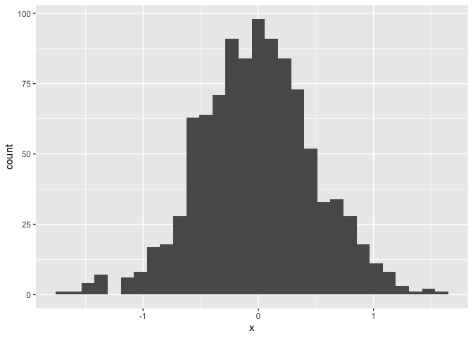
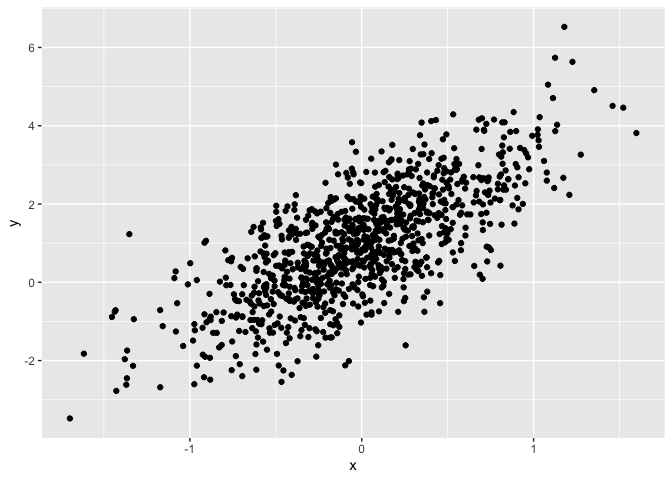

Basic Plots
================
Yingxi Ji
9/12/2019

## R Markdown

The purpose of this file is to present a couple of basic plots using
`ggplot`.

First we create a dataframe containing variables for our plots.

``` r
set.seed(1234)

plot_df = tibble(
  x = rnorm(1000, sd = .5),
  y = 1 + 2 * x + rnorm(1000)
)
```

First we show a histogram of the `x`
    variable.

``` r
ggplot(plot_df, aes(x = x)) + geom_histogram()
```

    ## `stat_bin()` using `bins = 30`. Pick better value with `binwidth`.

<!-- -->

Next we show a scatterplot of `y` vs `x`.

``` r
ggplot(plot_df, aes(x = x, y = y)) + geom_point()
```

<!-- -->
